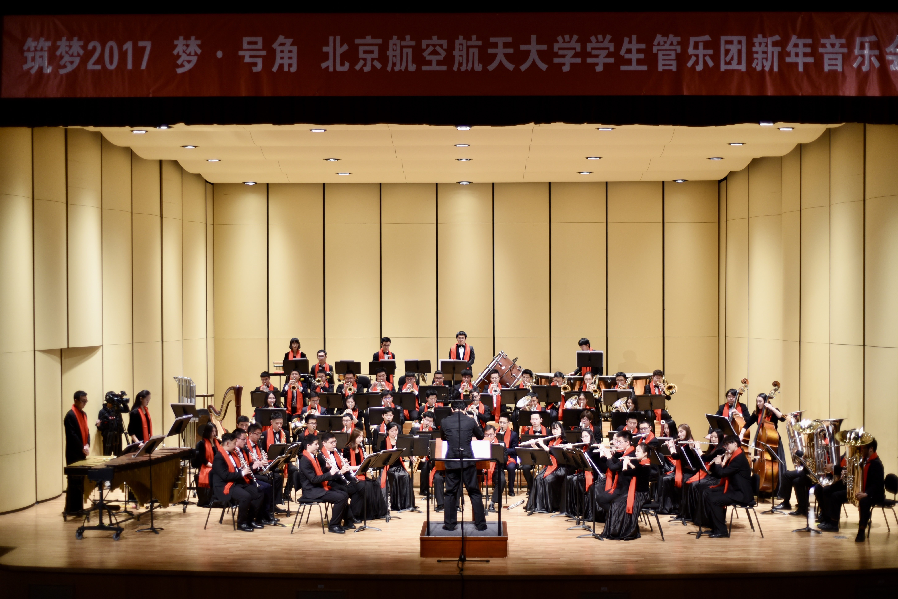
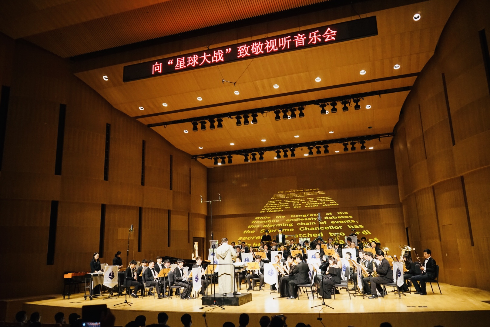
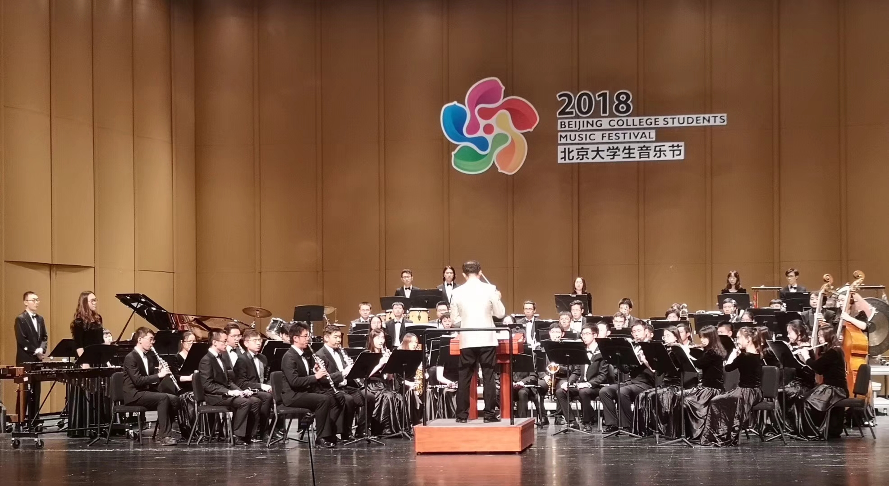
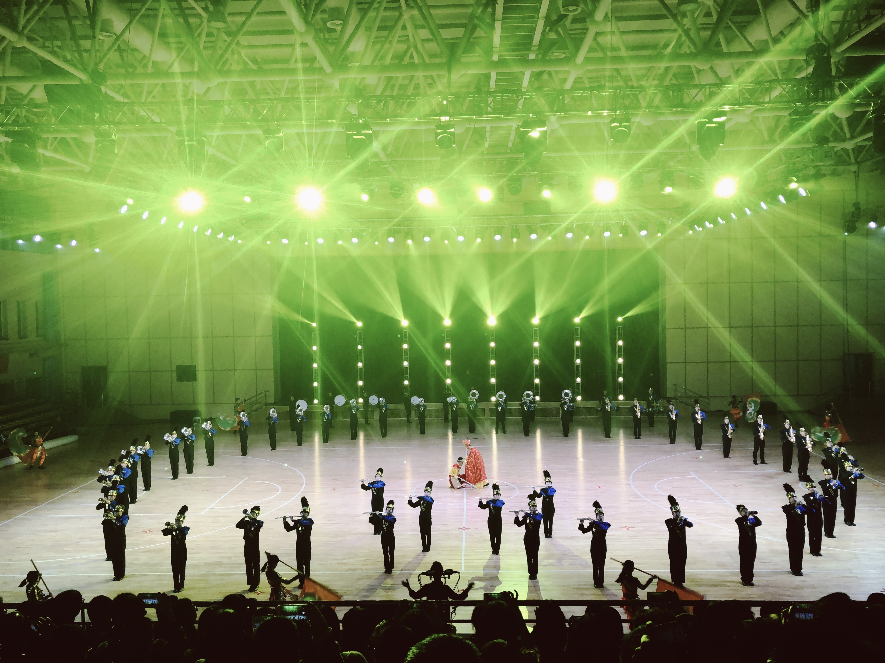
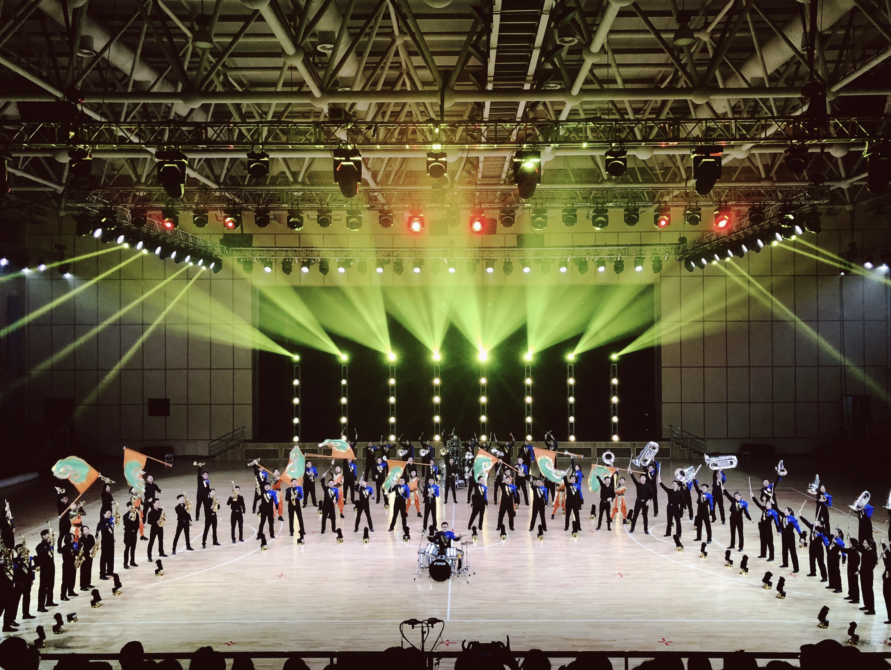

Out of my love for music, I have been studying classical saxophone for more than 15 years and was a saxophonist in **Zengguang Philharmonic Wind Orchestra** (Dec. 2018 - Aug. 2019) and **Wind Orchestra and Marching Band of Beihang University** (Sep. 2015 - Jun. 2019). 

> One band, one sound, one family. 

Years of experience in the orchestra not only made me gain valuable friendship, but also cultivated my spirit of cooperation. **I am very grateful for my time in the bands.**

