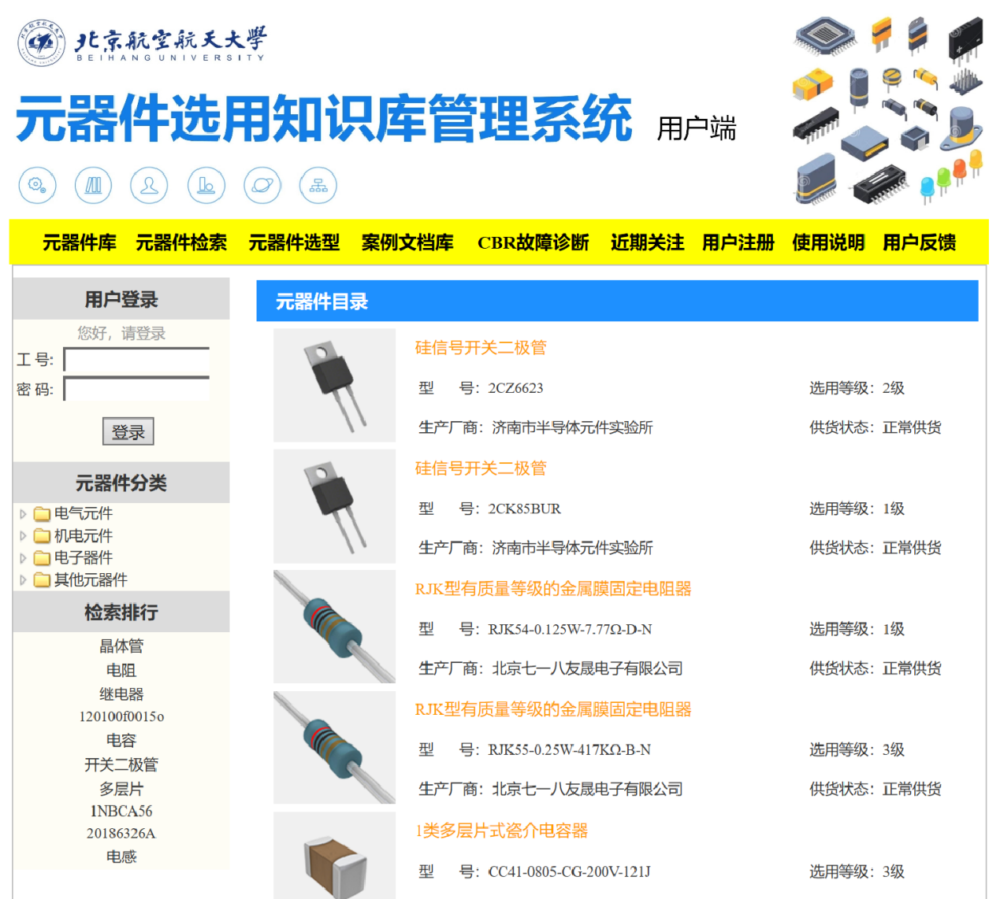

**Members:** Mingyang Xu

**Supervisor:** Prof. Guijiang Duan

# Overview

The objective of this study is to develop a software system that can assist in **the selection of appropriate components for engineering**. Since component selection is a critical task in the design process, it can be challenging due to the variety of components available, their specifications, and specific application requirements. To address this issue, **the proposed system uses a knowledge base that captures the expertise of domain experts, including component specifications, performance data, and application requirements.** The system also employs a reasoning mechanism that supports the selection of suitable components based on user-defined criteria. Finally, we evaluated the effectiveness of the system through case studies to measure its accuracy in providing component selection recommendations. The developed knowledge base management system is expected to improve the efficiency and accuracy of component selection in the engineering design process. By automating and streamlining the component selection process, the system could reduce the time and effort required to select the most appropriate components for a given application. Therefore, the system has the potential to benefit various industries, including electronics, manufacturing, and automotive, by providing reliable and efficient component selection recommendations.

