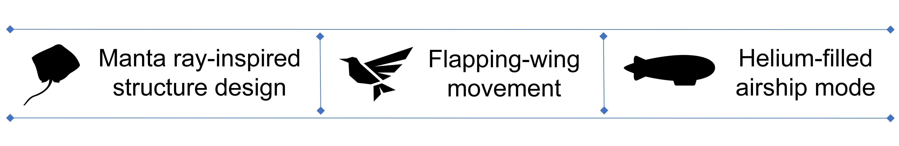

# Motivation:

The desire for **“Flying Through the Sea of Air”** is a vision that has constantly motivated us to explore the design of aerial robots since we noticed that **the manta ray swims through the water as a bird flies through the air**. Most conventional aerial robots are driven by propellers. However, the use of propellers is accompanied by noise and danger due to the high-speed rotation. Once the operating propeller accidentally touches persons or objects, injury or economic loss may result, which makes the propeller-based aerial robots usually unsuitable for indoor environment application. Biomimetics in propulsion inspires us to solve the above limitation. 



# Overview:

**In this study, we proposed an aerial robot that mimics the manta ray’s movement and is suitable for indoor-environment applications.** The robot mainly comprises a lightweight helium-filled ballonet, a noiseless flapping-wing actuator, a pitch control mechanism, and a tail-like rudder. In the flight tests, the prototypes not only demonstrated controlled and flexible flight but also were able to **execute manta-like high manoeuvring motions**. Long operation time was ensured due to the helium ballonet body, low-frequency flapping wing, and low-power electronics. Overall, the developed bioinspired robot is featured as energy-efficient, noiseless, and harmless for human-robot interaction. It can further bring new applications for aerial robotics, such as robot therapy (as comfort pets), long-time surveillance and event observation, and interactable and dynamic advertising media.

# Features

* Energy-efficient
* Noiseless
* Suitable for indoor environment
* **Harmless for human-robot interaction**

# Future Applications

* Interactable and dynamic advertising media
* Robot therapy (as comfort pets)
* Long-time surveillance and event observation
