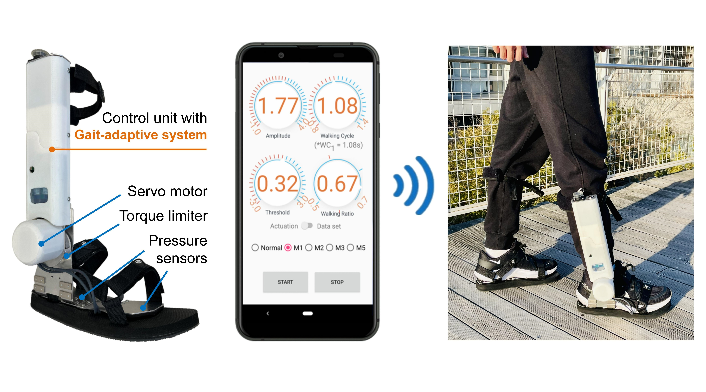

# Abstract

As the population ages, the number of elderly people suffering from systemic diseases such as stroke increases. To address this problem, various wearable walking assistive robots have been developed to promote physical exercise for stroke prevention. Wearable assistive robots have shown the ability to improve human mobility. However, most of these robots are heavy, bulky, and impractical. **In this study, we developed a compact ankle assistive robot for elderly users to promote walking exercise.** By informing the user of correct motion and timing, the robot can guide the user to achieve a healthy gait by only assisting their ankle joint. The robot provides faster-than-ankle motion to allow the user to feel supported while walking. Users can adjust the robot’s assistance parameters through a graphical user interface (GUI) according to their demands. Furthermore, **we proposed a gait-adaptive method for ankle assistive robots to adapt to the user’s changing gait.** Hence, the robot can automatically adjust the parameters to provide more accurate walking assistance. Finally, the results of an evaluation experiment demonstrated the positive feasibility of human gait adaptation. The proposed methods have the advantages of low cost and easy implementation.

# Related Publications

\[1] **M. Xu**, Y. Hua, Y. Li, J. Zhuang, K. Osawa, K. Nakagawa, H. Lee, L. Yuge, E. Tanaka, “Development of an Ankle Assistive Robot with Instantly Gait-Adaptive Method,” in *Journal of Robotics and Mechatronics (JRM)*, 2023. (Accepted)
