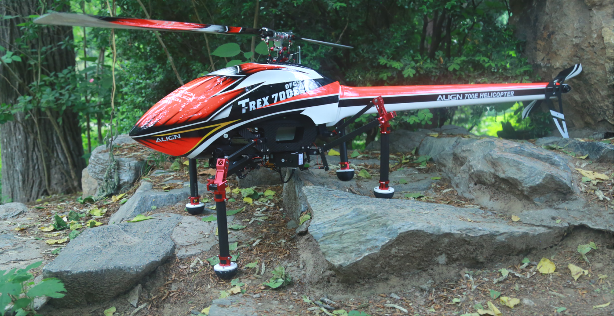
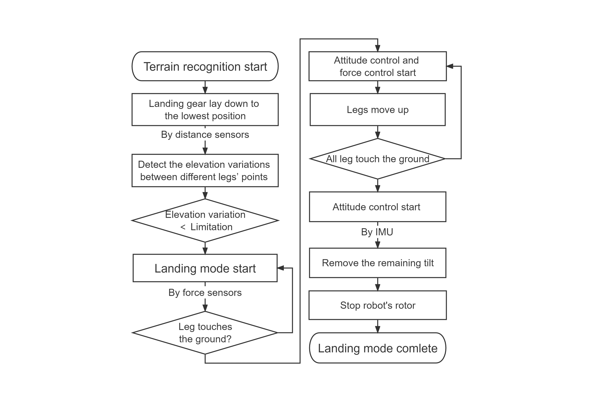

**Members:** Mingyang Xu, Yunkai Qi, Jin Zhu, Wanhe An, Dada Hu, Jiaxuan Zhang, Shiqi Sun

**Supervisor:** Prof. Tianmiao Wang

# Abstract

Vertical take-off and landing aircrafts (VTOLs) are widely used in transport and rescue tasks because of their ability to perform vertical takeoffs and landings. **However, the possibility of off-field landings is severely limited by non-flat landing areas. Some example landing areas include great slopes, rocky grounds, and stairs.** VTOL-type aerial robots that use conventional skids or landing wheels have poor ability to adapt to uneven and steep terrain, causing safety problems and economic losses. Aiming at the above limitations, we proposed a novel terrain-adaptive aerial robot. This aerial robot features robotic landing gear, which consists of four legs. Based on the force, attitude, and height data collected by the sensors, the landing gear could be automatically adjusted to conform closely with the ground, thus **keeping the robot horizontal and balanced during landing**. Finally, the laboratory experiment test and outfield flight test have been done to verify the results of the design and theory modelling.

# Video



